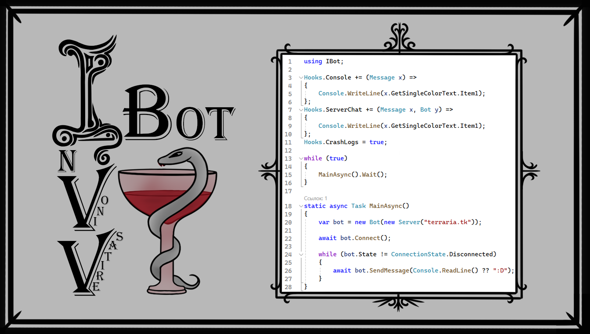

# Содержание репозитория
- `IBot` — файлы библиотеки;
- `Test` — папка с примерами использования библиотеки:
  - `Simple` — простейший пример, 
  - `Musician` — пример бота-музыканта, 
  - `DiscordBot` — пример бота с трансляцией чата в Дискорд;
- `References` — папка с вспомогательными библиотеками (для примеров).

# Обзорная документация
<ins>**Классы:**<ins>
- `Bot` — бот и сетевая работа с ним;
- `Server` — сервер, за которым закрепляются боты;
- `Hooks` — события (хуки) для перехвата системных сообщений, обработки сетевых процессов;
- `Player` — поведение и внешний вид бота как игрового персонажа;
- `Message` — обработка сообщений информационных и игрового чата;
- `Utils` — различного рода инструменты ("утилиты").

<ins>**Структуры:**<ins>
- `Packet` — сетевой пакет;
- `Buff` — баффы и дебаффы;
- `Item` — предметы.

<ins>**Перечисления:**<ins>
- `ClientVersion` — ;
- `ConnectionState` — ;
  - `` — ,
  - `` — ,
  - `` — ,
  - `` — ,
  - `` — ,
- `Control` — ;
- `Pulley` — ;
- `Miscs` — ;
- `Difficulty` — ;
- `Sleeping` — ;
- `HideVisuals` — ;
- `HideMisc` — ;
- `Team` — ;
- `TorchFlag` — ;
- `ReadItemOrder` — .

## Класс сервера
<ins>**Конструктор для создания объекта класса `Server` (сервера) содержит три необязательных аргумента:**<ins>
- `ip` — айпи-адрес сервера (по дефолту `"127.0.0.1"`);
- `port` — порт сервера (по дефолту `7777`);
- `version` — версия террарии (по дефолту `ClientVersion.Version1449`).

<ins>**Поля:**<ins>
- `Password` — пароль сервера;
- `Area` — прямоугольник, определяющий размеры мира;
- `Spawn` — точка мирового спавна;
- `Name` — название мира/сервера.

<ins>**Замечания:**<ins>
- Пароль, если требуется, задавать до подключения ботов к серверу;
- Поля `Area`, `Spawn` и `Name` определяются в процессе подключения ботов к серверу — дальше могут быть изменены как вами, так и сервером;
- Каждый новый объект класса `Server` определяет свой поток (`Thread`) для обработки сетевых пакетов — привязка ботов к тому или иному объекту класса `Server` определяет, какой поток они используют для обработки пакетов (многопоточность).

<ins>**Пример:**<ins>
```cs
var server = new Server("terraria.tk");
server.Password = "12345";

Console.WriteLine(server.ToString()); //--> terraria.tk:7777
```

## Класс бота
<ins>**Конструктор для создания объекта класса `Bot` (бота) содержит два аргумента:**<ins>
- `server` — сервер, к которому бот привязывается;
- `name` — ник бота, который рандомизируется, если не указывается.

<ins>**Свойства:**<ins>
- `ID` — номер сетевой ячейки (айди), занимаемой ботом в процессе подключения — используется в некоторых пакетах для идентификации;
- `Server` — закрепленный сервер;
- `Player` — игровой персонаж;
- `State` — сетевое состояние;
- `Version` — версия террарии (определяется сервером);
- `Name` — ник (определяется персонажем);

<ins>**Поля:**<ins>
- `UUID` — идентификатор для авторизации;
- `Zones` — данные для 36 пакета (опционально);
- `ResponseWaitingTime` — общее (`static`) время ожидания ответа от сервера в миллисекундах (по дефолту 3 минуты).

<ins>**Процессы подключения:**<ins>
- a
- a
- a
- a
- a
- a

<ins>**Замечания:**<ins>
- Если необходимо авторизовать бота за какой-либо аккаунт на сервере, задайте `UUID` перед подключением — при этом `Name` должен быть равен нику этого аккаунта;
- Ваш `UUID` находится в файле `config.json` по пути `..\Документы\My Games\Terraria`;
- Старайтесь сохранять все ваши `UUID` в тайне и не заходите на сервера, которые могут ими злоупотреблять!


